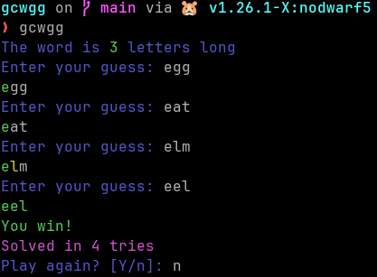

# gcwgg
Go CLI Word Guessing Game

## What is this project about?
This is a simple CLI Word Guessing Game inspired by hangman. It is written in Go

## Why did you make this?
I was bored.

## Compilation
```bash
git clone https://github.com/Moritisimor/gcwgg
cd gcwgg
go build -ldflags="-s -w" cmd/gcwgg/main.go
./main
```

## How do I use it?
This program has 2 ways of getting random words. 

### No external file
The first way is the fallback way that most users will want to use. Here, the program loads around 200 words from RAM. No external file necessary. Plug and play!

### With external file
The second way works by giving the program a CLI arg with the path to the file.

If the file is not found it will report the error back to you and fall back to the pre-programmed words.

## Gameplay
Here is some professional gameplay



## Credits
Many thanks to [this site](https://texttools.org/random-word-generator) for generating random words for me.
